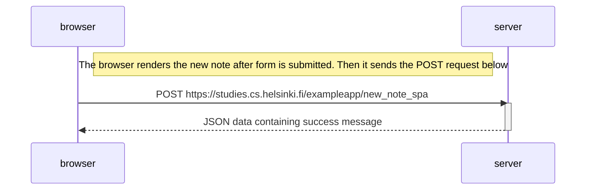

# Exercise 0.6: Single page app diagram

```mermaid
sequenceDiagram
    participant browser
    participant server

    Note right of browser: The browser renders the new note after form is submitted. Then it sends the POST request below
    browser->>server: POST https://studies.cs.helsinki.fi/exampleapp/new_note_spa
    activate server
    server-->>browser: JSON data containing success message
    deactivate server
```
